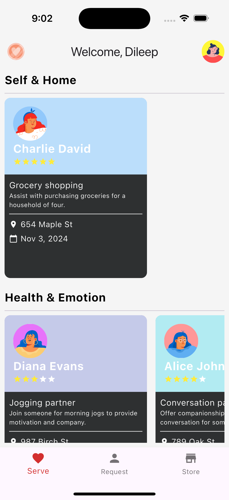
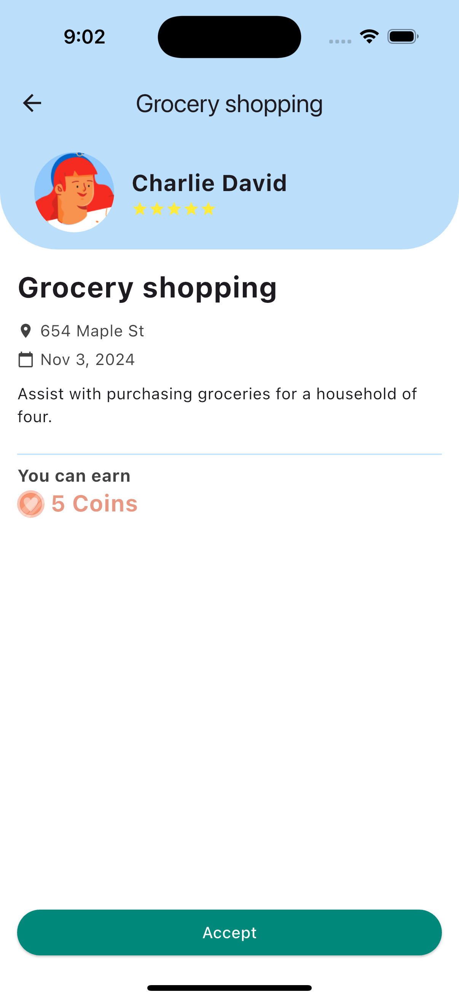
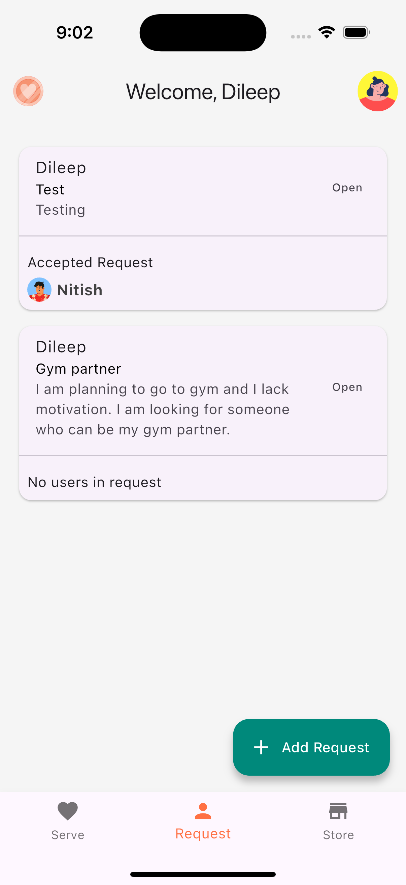
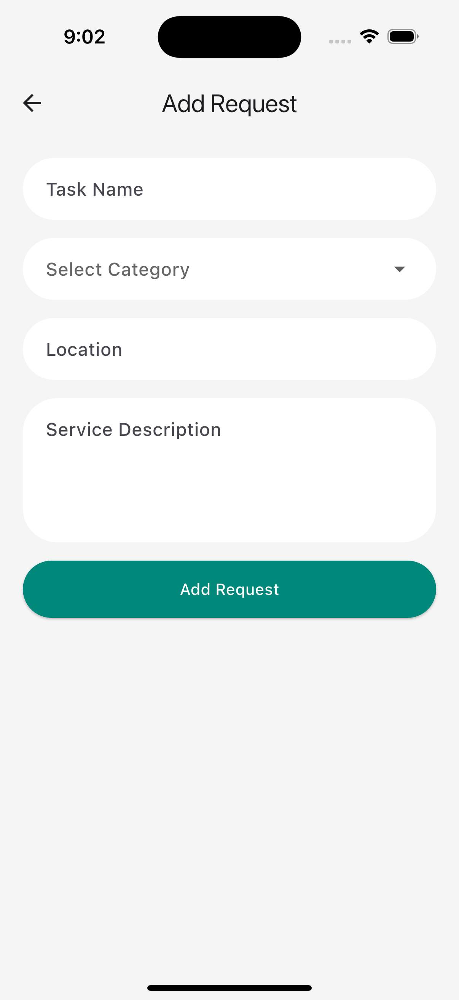
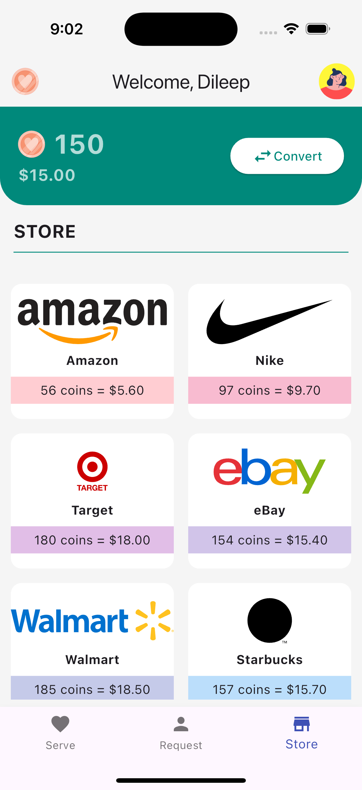
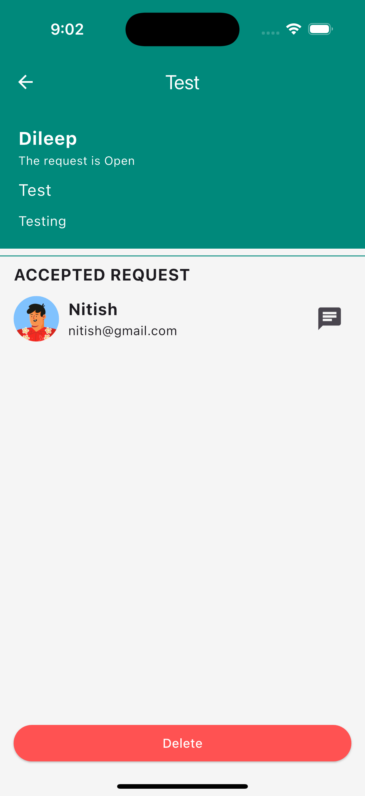
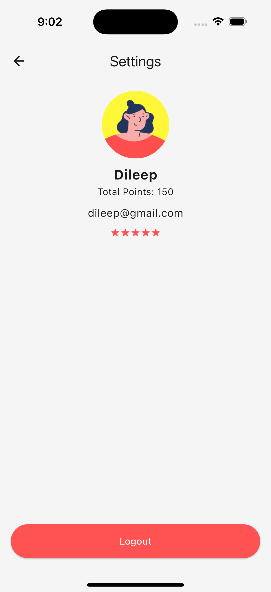
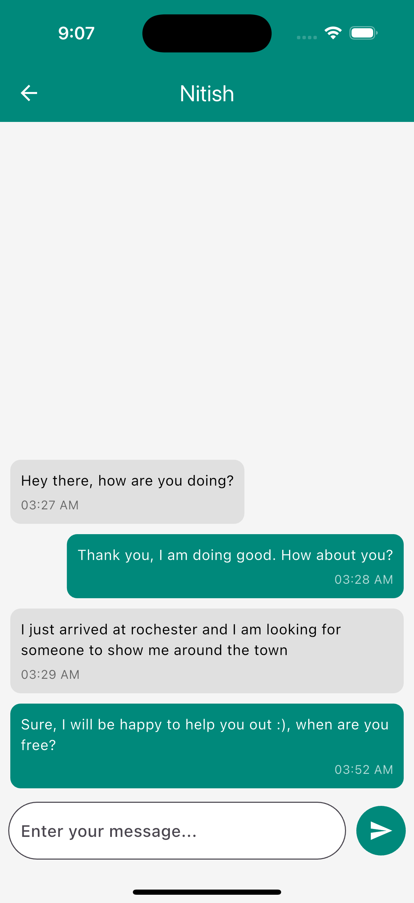

# GoodDeeds: Community Service Marketplace

GoodDeeds is a community-focused service marketplace designed to help newcomers, like international students and recent residents, find trusted local services and build a support network. Our mission is to foster connections and create a platform where people can request or offer help, strengthening community bonds.

---

## 📌 Project Inspiration

GoodDeeds was inspired by the challenges faced by newcomers who often struggle to find reliable local services and build connections in unfamiliar communities. Our goal was to create a safe, welcoming platform that enables users to offer and receive help, such as dog walking, tutoring, or grocery shopping, building trust and support within the community.

---

## 🌟 Features

- **Request and Offer Services:** Users can post service requests or offer assistance in various areas, such as pet care, academic tutoring, or grocery shopping.
- **User Profiles with Ratings and Reviews:** Each user can build a profile with ratings and reviews to help establish credibility and trust within the community.
- **In-App Messaging:** Integrated messaging for seamless communication and coordination between users.
- **Task Tracking and Optional Payment Management:** Users can keep track of tasks and manage payments (if required) directly within the app.
- **Enhanced Security and Privacy:** Includes features like identity verification, encrypted messaging, emergency contacts, and privacy controls to ensure a safe environment.

---

## 🛠️ Tech Stack

### 1. **Flutter**

- **Cross-Platform Development:** Used Flutter to ensure a responsive, consistent user experience across both Android and iOS devices.
- **UI/UX Design:** Flutter’s widget library allowed us to design a visually appealing and intuitive interface that’s easy to navigate.
- **State Management with Riverpod:** Riverpod handles state efficiently across screens, providing reactive updates and a smooth user experience, especially for real-time data handling.

### 2. **Firebase**

- **Authentication:** Firebase Authentication secures the platform by providing various login methods, ensuring user identity verification for a safe environment.
- **Real-Time Database:** Manages all user data and requests with real-time syncing across devices, allowing instant updates for users.
- **Cloud Messaging:** Enables notifications and in-app messaging, allowing users to coordinate and receive updates on their tasks seamlessly.

### 3. **Riverpod for State Management**

- **Efficient State Management:** We chose Riverpod to manage the app’s state, handling reactive updates across different screens and ensuring efficient data flow, especially for the real-time aspects of Firebase.
- **Scoped Dependencies:** By using Riverpod, we were able to define dependencies precisely, reducing resource usage and enhancing performance.

## 📷 Screenshots

Here are some screenshots of GoodDeeds in action:

<table>
  <tr>
    <td></td>
    <td></td>
    <td></td>
    <td></td>
  </tr>
  <tr>
    <td></td>
    <td></td>
    <td></td>
    <td></td>
  </tr>
</table>
